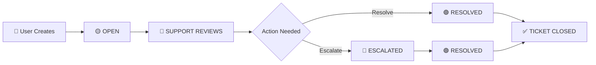

# 🎫 User Support System Documentation

## 📖 Table of Contents
- [Overview](#overview)
- [User Roles & Access](#user-roles--access)
- [Creating Support Tickets](#creating-support-tickets)
- [Managing Tickets (Support Staff)](#managing-tickets-support-staff)
- [Managing Tickets (Admin)](#managing-tickets-admin)
- [Ticket Lifecycle](#ticket-lifecycle)
- [Support Workflow](#support-workflow)
- [File Attachments](#file-attachments)
- [Support Features by Role](#support-features-by-role)
- [Troubleshooting](#troubleshooting)
- [Best Practices](#best-practices)

---

## 🎯 Overview

The User Support system is a comprehensive ticket-based support platform designed to help users get assistance with voting system issues. It provides a structured way to handle support requests, track their resolution, and ensure timely responses.

### 🌟 Key Features
- **Multi-role Access**: Support for voters, nominees, support staff, and admins
- **Ticket Management**: Create, edit, resolve, and escalate tickets
- **File Attachments**: Upload images and documents for better issue description
- **Status Tracking**: Real-time status updates and notifications
- **Dashboard Analytics**: Support metrics and performance tracking

---

## 👥 User Roles & Access

### 🎫 Support Access Levels

| Role | Access Level | Permissions |
|------|--------------|-------------|
| **🔴 ADMIN** | Full Control | View all tickets, delete tickets, manage support settings |
| **🟡 SUPPORT** | Dedicated Support | Handle tickets, resolve issues, escalate problems |
| **🟣 NOMINEE** | User Support | Create/edit own tickets, view personal ticket history |
| **🔵 VOTER** | User Support | Create/edit own tickets, view personal ticket history |

### 🔧 Role-Specific Features

#### 👤 **User Level (Voter/Nominee)**
- ✅ Create support tickets
- ✅ View personal tickets only
- ✅ Edit OPEN tickets (own tickets)
- ✅ Upload file attachments
- ✅ Track ticket status

#### 🎫 **Support Level**
- ✅ View all tickets
- ✅ Resolve tickets with responses
- ✅ Escalate complex issues
- ✅ Filter tickets by status
- ✅ Access support dashboard

#### 🛡️ **Admin Level**
- ✅ All support permissions
- ✅ Delete tickets permanently
- ✅ Access full admin support panel
- ✅ System-wide support oversight

---

## 📝 Creating Support Tickets

### 🚀 For Voters

**Access:** `http://localhost:8080/voter/tickets/new`

#### 📋 Steps to Create a Ticket:

1. **Navigate to Tickets**
   ```
   Voter Dashboard → Support/Tickets → Create New Ticket
   ```

2. **Fill Required Information**
   - **Subject**: Brief description (5-100 characters)
   - **Description**: Detailed explanation (20-2000 characters)
   - **Attachment**: Optional file upload (max 10MB)

3. **Submit Ticket**
   - Click "Submit Ticket"
   - Ticket automatically assigned OPEN status
   - Confirmation message displayed

#### 🔧 Voter Ticket Guidelines

**Good Subject Examples:**
- ✅ "Cannot vote in Dancing Star event"
- ✅ "Unable to upload profile photo"
- ✅ "Login keeps failing"

**Good Description Examples:**
- ✅ Include step-by-step error reproduction
- ✅ Provide screenshots when possible
- ✅ Mention browser/device information
- ✅ Explain expected vs actual behavior

### 🏆 For Nominees

**Access:** `http://localhost:8080/nominee/tickets/new`

#### 📋 Nominee-Specific Ticket Creation:

Process identical to voters, but with nominee-specific context:

**Common Nominee Issues:**
- Document upload failures
- Profile editing problems
- Nomination submission errors
- Deadline clarification requests

---

## 🛠️ Managing Tickets (Support Staff)

### 📊 Support Dashboard

**Access:** `http://localhost:8080/support/dashboard`

#### 📈 Dashboard Metrics

**Statistics Cards:**
- **📊 Total Tickets**: Complete ticket count
- **🟡 Open Tickets**: New requests awaiting response
- **🟢 Resolved Tickets**: Successfully closed tickets
- **🔴 Escalated Tickets**: Complex issues requiring attention

### 🎫 Ticket Management Operations

#### 🔍 **Viewing Tickets**

| View Type | URL | Purpose |
|-----------|-----|---------|
| **All Tickets** | `/support/tickets` | Complete ticket overview |
| **Open Only** | `/support/tickets/open` | Focus on new requests |
| **Resolved Only** | `/support/tickets/resolved` | Review completed work |
| **Escalated Only** | `/support/tickets/escalated` | Handle priority issues |

#### 📋 **Ticket Details Page**

**Access:** `http://localhost:8080/support/tickets/{id}`

**Information Displayed:**
```
🎫 Ticket ID: Unique identifier
📊 Current Status: Open/Resolved/Escalated
👤 Submitted By: User information
📅 Created Date: Ticket submission time
📋 Subject: Issue summary
📝 Description: Detailed problem description
📎 Attachments: Any uploaded files
⏰ Resolution Time: Time taken to resolve
💬 Support Responses: Admin/support replies
```

#### ⚡ **Support Actions**

##### ✅ **Resolve Ticket**
- **Action**: `POST /support/tickets/{id}/resolve`
- **Purpose**: Close ticket with solution
- **Requirements**: Response message required
- **Result**: Status changes to RESOLVED

**Resolution Response Guidelines:**
- Provide clear step-by-step solution
- Include any relevant links or resources
- Confirm issue is resolved
- Ask for confirmation if needed

##### 🚨 **Escalate Ticket**
- **Action**: `POST /support/tickets/{id}/escalate`
- **Purpose**: Raise priority for complex issues
- **Requirements**: Automatic escalation
- **Result**: Status changes to ESCALATED

**Escalation Criteria:**
- Technical system bugs
- Issues affecting multiple users
- Complex configuration problems
- High-priority user complaints

---

## 🛡️ Managing Tickets (Admin)

### 🎛️ Admin Support Panel

**Access:** `http://localhost:8080/admin/tickets`

#### ⚡ Admin-Specific Actions

##### 🗑️ **Delete Ticket**
- **Action**: `POST /admin/tickets/{id}/delete`
- **Purpose**: Permanently remove ticket
- **Warning**: Irreversible action
- **Confirmation**: Required before deletion

#### 🎯 Admin Dashboard Integration

**Support metrics integrated into admin dashboard:**
- Open ticket count
- Ticket resolution statistics
- User satisfaction metrics
- System-wide support trends

---

## 🔄 Ticket Lifecycle

### 📊 Status Flow



### 🎯 Status Definitions

| Status | Icon | Description | User Can Edit | Actions Available |
|--------|------|-------------|---------------|------------------|
| **🟡 OPEN** | Warning | New ticket awaiting support | ✅ Yes | Resolve, Escalate |
| **🟢 RESOLVED** | Success | Issue solved with response | ❌ No | View only |
| **🔴 ESCALATED** | Danger | High priority/complex issue | ❌ No | Resolve, Further escalation |

### ⏱️ Timeline Expectations

| Stage | Timeframe | Description |
|-------|-----------|-------------|
| **📝 Submission** | Immediate | Ticket created instantly |
| **🎫 Review** | Within 24 hours | Support staff acknowledgment |
| **🔧 Resolution** | 24-48 hours | Most tickets resolved |
| **🚨 Escalation** | 2-4 hours | Urgent issues prioritized |

---

## 🚀 Support Workflow

### 📋 Complete Support Process

#### 👤 **User Side Workflow**

```
1. Issue Identified → 2. Ticket Created → 3. Ticket Submitted
                            ↓
6. Issue Resolved ← 5. Response Received ← 4. Support Reviews
```

#### 🎫 **Support Side Workflow**

```
1. Ticket Received → 2. Issue Analysis → 3. Solution Development
                           ↓
6. Resolution Confirmed ← 5. User Response ← 4. Solution Provided
```

#### 👔 **Admin Side Workflow**

```
1. System Monitoring → 2. Performance Review → 3. Process Optimization
                           ↓
4. Policy Updates ← 3. Escalation Handling ← 2. Issue Review
```

---

## 📎 File Attachments

### 🗃️ Supported File Types

| Category | Format | Use Case |
|----------|--------|----------|
| **Images** | JPG, PNG, GIF | Screenshots, error displays |
| **Documents** | PDF, DOC, DOCX | Reports, error logs |
| **Text** | TXT | Configuration files, simple logs |

### 📏 File Upload Limits

- **Maximum Size**: 10MB per file
- **Files Per Ticket**: Single attachment allowed
- **Compression**: Automatic resizing for images

### 💡 Attachment Best Practices

#### ✅ **Good Attachments**
- Screenshots of error messages
- Configuration file excerpts
- Documentation references
- Video recordings (small files)

#### ❌ **Avoid Attachments**
- Personal documents unrelated to issue
- Large video files (>10MB)
- Sensitive business information
- Copyright-protected materials

---

## 🎭 Support Features by Role

### 👤 **Voter Support Features**

#### 🗳️ **Core Voting Support**
- Vote button not appearing
- Unable to select nominees
- Vote submission failures
- Event access issues

#### 🔧 **Technical Support**
- Login problems
- Session timeouts
- Browser compatibility issues
- Mobile access problems

### 🏆 **Nominee Support Features**

#### 📋 **Nomination Support**
- Profile upload failures
- Document submission issues
- Nomination deadline questions
- Category selection problems

#### 🔧 **Profile Management**
- Account editing issues
- Profile photo uploads
- Biography formatting problems
- Contact information updates

### 🎫 **Support Staff Features**

#### 🛠️ **Ticket Management**
- View all tickets across platform
- Filter and sort by status
- Batch operations
- Priority assignment

#### 📈 **Performance Tracking**
- Resolution time metrics
- User satisfaction tracking
- Common issue identification
- Workload distribution

### 🛡️ **Admin Features**

#### 🎛️ **System Management**
- Complete ticket oversight
- System-wide issue analysis
- Support policy configuration
- Team performance monitoring

#### 🔧 **Maintenance Tools**
- Bulk ticket operations
- Archive old tickets
- Export support data
- Generate support reports

---

## 🔧 Troubleshooting

### 🚨 Common Issues & Solutions

#### 📝 **Ticket Creation Problems**

**Issue**: Cannot submit ticket
- ✅ Check subject length (5-100 characters)
- ✅ Check description length (20-2000 characters)
- ✅ Verify file size (≤10MB)
- ✅ Ensure stable internet connection

**Issue**: File upload failure
- ✅ Confirm file type (JPG, PNG, PDF, DOC, DOCX, TXT)
- ✅ Check file size (≤10MB)
- ✅ Try smaller file or compress image
- ✅ Use different browser

#### 🎫 **Ticket Management Problems**

**Issue**: Cannot view tickets
- ✅ Verify proper login
- ✅ Check user role permissions
- ✅ Clear browser cache
- ✅ Try different browser

**Issue**: Cannot edit ticket
- ✅ Confirm ticket status is OPEN
- ✅ Verify ownership of ticket
- ✅ Check if resolution already provided
- ✅ Contact admin if persistent

#### 🛠️ **Support Staff Issues**

**Issue**: Cannot resolve tickets
- ✅ Verify SUPPORT or ADMIN role
- ✅ Check ticket status
- ✅ Provide response message
- ✅ Submit resolution properly

**Issue**: Dashboard not updating
- ✅ Refresh page
- ✅ Check database connection
- ✅ Verify ticket service status
- ✅ Contact system administrator

---

## 📊 Support Metrics & Analytics

### 📈 Key Performance Indicators (KPIs)

#### ⏱️ **Response Time Metrics**
- **First Response**: Time to initial acknowledgment
- **Resolution Time**: Time to complete ticket closure
- **SLA Compliance**: Percentage meeting service level agreements

#### 📊 **Volume Metrics**
- **Tickets Per Day**: Daily support request volume
- **Peak Hours**: Busiest support periods
- **Seasonal Trends**: Ticket volume patterns

#### 🎯 **Quality Metrics**
- **Resolution Rate**: Percentage of successfully closed tickets
- **Escalation Rate**: Percentage requiring escalation
- **Reopen Rate**: Tickets reopened after resolution
- **User Satisfaction**: Feedback on support quality

### 📋 **Reporting Features**

#### 📅 **Daily Reports**
- Tickets created
- Tickets resolved
- Average resolution time
- Escalation frequency

#### 📊 **Weekly Summaries**
- Performance trends
- Common issue identification
- Support team workload
- User satisfaction scores

#### 📈 **Monthly Analysis**
- Comprehensive performance review
- Process improvement recommendations
- Staff training needs assessment
- System enhancement suggestions

---

## 🎯 Best Practices

### 👥 **For Users**

#### 📝 **Creating Effective Tickets**
- **Be Specific**: Detailed description of issue
- **Provide Context**: Browser, device, time of occurrence
- **Include Steps**: How to reproduce the problem
- **Attach Evidence**: Screenshots or error messages

#### 🔍 **Communication Tips**
- **Stay Patient**: Allow 24-48 hours for response
- **Be Clear**: Use simple, understandable language
- **Follow Up**: Update if issue changes or persists
- **Provide Feedback**: Rate support quality when asked

### 🎫 **For Support Staff**

#### ⚡ **Effective Resolution**
- **Acknowledge Quickly**: Respond within 24 hours
- **Ask Questions**: Clarify unclear issues
- **Provide Solutions**: Give step-by-step instructions
- **Follow Through**: Confirm resolution works

#### 📊 **Workload Management**
- **Prioritize**: Handle escalated tickets first
- **Batch Process**: Group similar issues
- **Document Everything**: Note actions taken
- **Communicate**: Keep users informed of progress

### 🛡️ **For Administrators**

#### 📈 **System Optimization**
- **Monitor Trends**: Watch for recurring issues
- **Train Staff**: Ensure proper support techniques
- **Update Policies**: Modify procedures based on data
- **Improve Tools**: Enhance support based on feedback

#### 🎯 **Quality Assurance**
- **Review Performance**: Regular KPI assessment
- **Satisfaction Surveys**: Collect user feedback
- **Process Audit**: Ensure standards compliance
- **Continuous Improvement**: Implement enhancements

---

## 🔗 Related Documentation

- [Admin System Guide](./ADMIN_GUIDE.md) - Complete admin functionality
- [Voter Guide](./VOTER_GUIDE.md) - Voting system usage
- [Nominee Guide](./NOMINEE_GUIDE.md) - Nomination process
- [Technical Documentation](./TECHNICAL_GUIDE.md) - System architecture

---

## 📞 Contact & Support

### 🆘 **Emergency Support**
- **Critical Issues**: Contact admin immediately
- **System Outages**: Escalate to technical team
- **Security Concerns**: Report to security team

### 📧 **Support Channels**
- **Ticket System**: Primary support method
- **Email**: For admin-level issues
- **Phone**: Emergency technical support only

### 📚 **Additional Resources**
- **User Manual**: Complete system guide
- **FAQ Section**: Common questions and answers
- **Video Tutorials**: Step-by-step guides
- **Documentation Portal**: Technical references

---

**Last Updated**: `2025-10-02`
**Version**: `1.0`
**Maintainer**: Voting System Support Team

> 💡 **Tip**: For the best support experience, always include detailed information about your issue and any relevant screenshots or error messages.

---

## 🎉 Conclusion

The User Support system provides comprehensive, efficient, and user-friendly support management for the entire voting platform. With role-based access, detailed tracking, and powerful management tools, it ensures users get the help they need while maintaining proper oversight and control.

Whether you're a user seeking help, support staff resolving issues, or an administrator overseeing the system, this documentation provides everything needed to effectively use and manage the support system.
